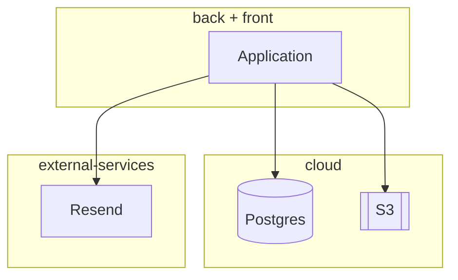
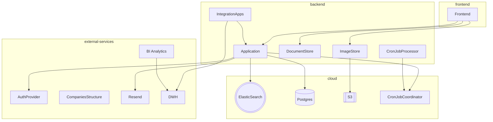

## HR Zero – проект для хакатона Лидеры Цифровой Трансформации (Краснодар) 2023

### Что успели сделать за 192 часа!

- 🎉 Бэкенд и фронт сервиса проведения онбординга сотрудников.
- 🌏 Интерфейс для добавления отделов сотрудников в базу данных
- 📕 Редактор документов.
- ✅ Редактор опросов.
- 💾 Две обучающие игры, чтобы знакомить новичка с коллективом
- 🧨 Server-side рендеринг на фронте, для лучшего SEO!

## Репозиторий

* https://github.com/lct23/krasnodar

## Стек технологий

* Бэкенд и вся бизнес-логика на Common Lisp.
* На фронтенде TailwindCSS + немного AlpineJS.
* База данных - PostgreSQL в облаке.
* Resend.com - для отправки email уведомлений.
* Российский аналог S3 для хранения аватаров.
* Развёртывание в Docker.

## Архитектура MVP

Для простоты и скоростиi MVP реализован в виде одного сервиса связанного с базой.
Мы использовали server-side рендеринг для того, чтобы всю бизнес-логику можно было
реализовать на фронтенде и не требовалось много JavaScript кода.

Так же, для простоты задачи которые должны выполняться по расписанию, запускаются тем же бэкендом.

Вот так выглядит сейчас архитектура сервиса:

## Развитие архитектуры

Понятно, что для стабильной работы сервис надо масштабировать, нужно интегрировать его с другими сервисами: аутентификацией, DWH, BI системой.
Для этого стоит добавить в картину "парочку" компонент:

