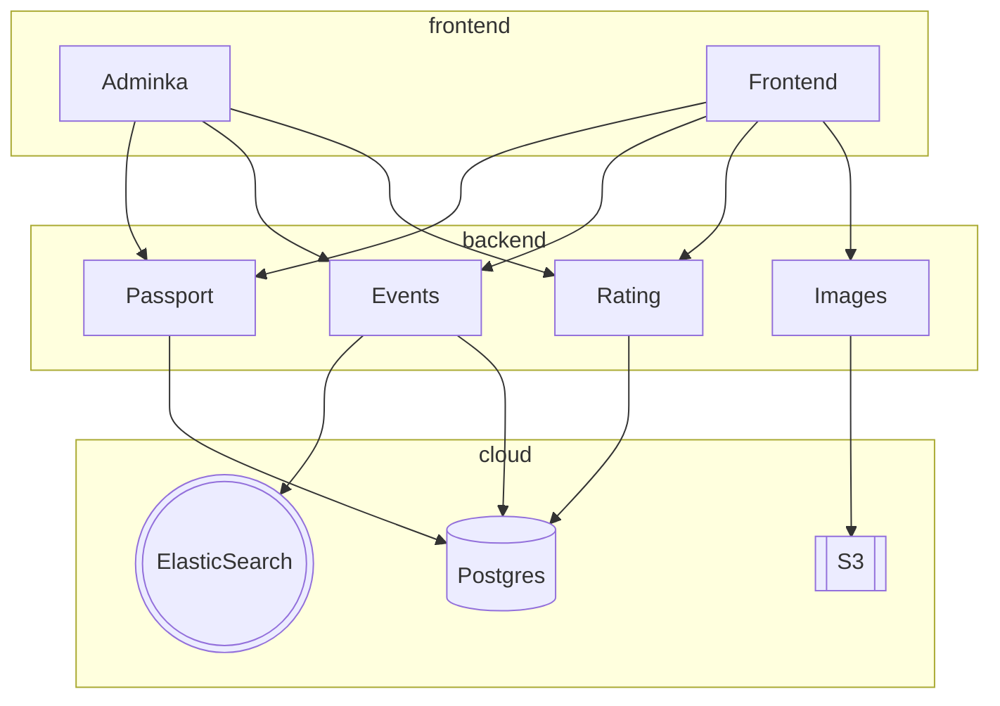

## HR Zero – проект для хакатона Лидеры Цифровой Трансформации (Краснодар) 2023

### Что успели сделать за 192 часа!

- 🎉 Бэкенд и фронт сервиса проведения онбординга сотрудников.
- 🌏 Интерфейс для добавления отделов сотрудников в базу данных
- 📕 Редактор документов.
- ✅ Редактор опросов.
- 💾 Две обучающие игры, чтобы знакомить новичка с коллективом
- 🧨 Server-side рендеринг на фронте, для лучшего SEO!

## Репозиторий

* https://github.com/lct23/krasnodar

## Стек технологий

* Бэкенд и вся бизнес-логика на Common Lisp.
* На фронтенде TailwindCSS + немного AlpineJS.
* База данных - PostgreSQL в облаке.
* Resend.com - для отправки email уведомлений.
* Развёртывание в Docker.

## Архитектура MVP

Для простоты и скоростиi MVP реализован в виде одного сервиса связанного с базой.
Мы использовали server-side рендеринг для того, чтобы всю бизнес-логику можно было
реализовать на фронтенде и не требовалось много JavaScript кода.

Так же, для простоты задачи которые должны выполняться по расписанию, запускаются тем же бэкендом.

Общение микросервисов между собой и с фронтендом идёт по JSON-RPC, что позволяет быстро добавлять необходимый функционал, не тратя время на попытки вписать его в ограничения HTTP. Кроме того, этот протокол так же может быть использован поверх Websocket, для создания более динамичных фичей сайта.

Фронтенд использует React.JS и Next.JS для server-side рендеринга. Это должно облегчить поисковую оптимизация и обеспечит сайту приток новых пользователей из поисковых систем типа Яндекс и Google.

Админка тоже использует server-side рендеринг, но построена на базе другого фреймворка - Reblocks, потому что в нём хорошо ориентируется наш бэкендер. Этот фреймворк позволяет быстро проверять идеи и реализовывать фичи, потому что всю бизнес-логику можно описывать на бэкенде, с использованием языка программирования Common Lisp.

И микросервисы, и фронтенд собираются в Docker контейнеры и могут быть развёрнуты в любом "облаке".

