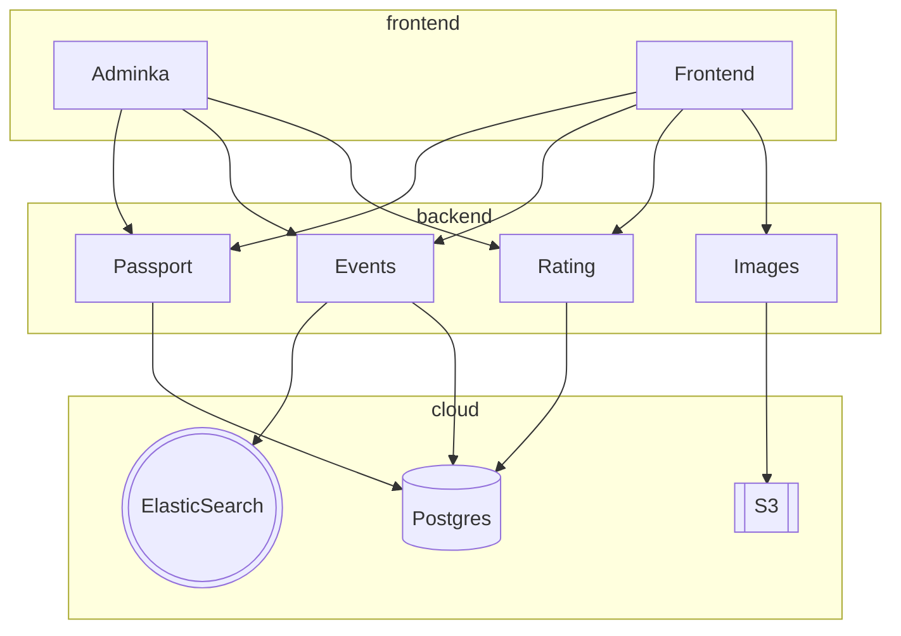

## EventLoop – проект для хакатона Лидеры Цифровой Трансформации 2023

**Демо-стенд:** https://lct23.dev.40ants.com/  
**Админка:** https://lct23.dev.40ants.com/admin/  

Учётка пользователя с правами админа: логин `admin@mail.ru` пароль `test`.

### Что успели сделать за 264 часа!

- 🎉 Поиск площадок с учётом бронирования!
- 🌏 Микросервисная архитектура на бэкенде!
- 📕 Единая система аутентификации и авторизации.
- ✅ Возможность добавлять новые типы услуг.
- 💾 Реализовали 4 микросервиса из 5.
- 🧨 Server-side рендеринг на фронте, для лучшего SEO!
- 🥷 Отдельный интерфейс для модерации.

## Репозитории

* [Backend](https://github.com/lct23/backend)
* [Frontend](https://github.com/lct23/frontend)

## Архитектура

Мы реализовали микросервисную архитектуру и успели реализовать 4 микросервиса:

- passport - хранит информацию о пользователях и их компаниях, в нём реализована аутентификация и авторизация.
- events - хранит информацию о сервисах разных типах, мероприятиях и прочей бизнес-логике связанной с ними.
- rating - тут лежат комментарии с оценками площадок и услуг, а так же он занимается рассчётом рейтинга площадок.
- images - позволяет загружать и получать картинки. В MVP они хранятся локально, но для продакшн решения нужно будет сделать сохранение изображений в S3 совместимое хранилище СберКлауда.

Общение микросервисов между собой и с фронтендом идёт по JSON-RPC, что позволяет быстро добавлять необходимый функционал, не тратя время на попытки вписать его в ограничения HTTP. Кроме того, этот протокол так же может быть использован поверх Websocket, для создания более динамичных фичей сайта.

Фронтенд использует React.JS и Next.JS для server-side рендеринга. Это должно облегчить поисковую оптимизация и обеспечит сайту приток новых пользователей из поисковых систем типа Яндекс и Google.

Админка тоже использует server-side рендеринг, но построена на базе другого фреймворка - Reblocks, потому что в нём хорошо ориентируется наш бэкендер. Этот фреймворк позволяет быстро проверять идеи и реализовывать фичи, потому что всю бизнес-логику можно описывать на бэкенде, с использованием языка программирования Common Lisp.

И микросервисы, и фронтенд собираются в Docker контейнеры и могут быть развёрнуты в любом "облаке".

### Поиск площадок и сервисов

У площадок есть ряд свойств, список которых задаётся через базу данных и может расширяться. Свойства делятся на категории: основные, оборудование, правила поведения, и тд. Свойства бывают разных типов: бинарные, численные, строковые. При индексации площадки, все её свойства складываются в Elastic Search как единый документ, что позволяет, искать по любым свойствам. Но в UI прототипа мы пока поддержали фильтрацию лишь по некоторым.

### Учёт бронирования

Бронирования площадок хранятся в отдельной таблице БД. Каждое бронирование складыватся, как дочерний документ в тот же поисковый индекс ElasticSearch, что и документы площадок. Это позволяет делать range запросы с тем, чтобы выбрать лишь те площадки, которые не забронированны в указанный период времени. Мы полагаем, что это должно достаточно хорошо масштабироваться, особенно учитывая, что бронирования, которые оказались "в прошлом", можно будет из поискового индекса удалять.
